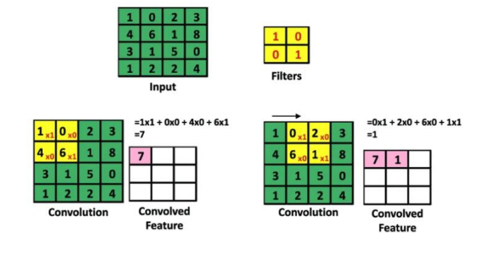
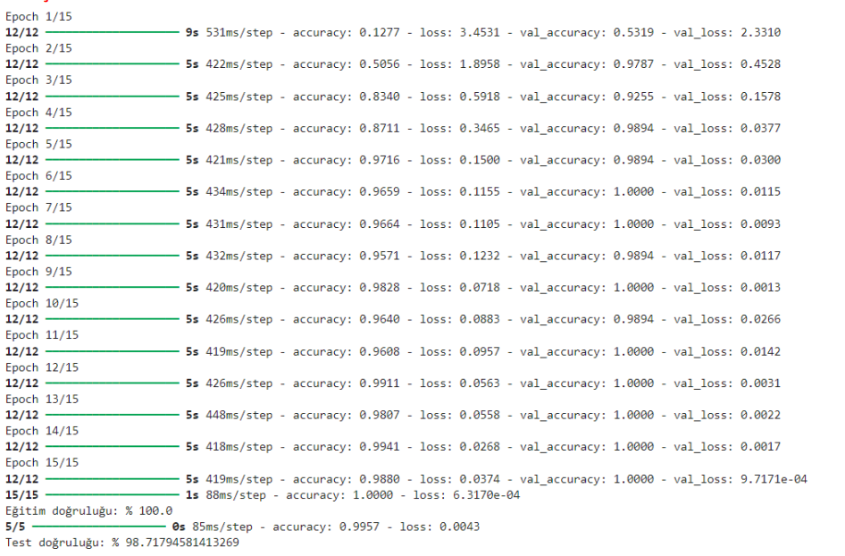

## CMU-Face-Images-Verisetinin-CNN-Modeli-Ile-Siniflandirilmasi
# GİRİŞ
Bu rapor, gri tonlamalı görüntülerden oluşan özel bir veri kümesi kullanarak yüz tanıma için 
CNN'lerin uygulanmasını ayrıntılarıyla ele alıyor.
Evrişimsel sinir ağlarını açıklayıp ; veri setini inceleyip ; veri ön işleme adımlarını, model 
mimarisini, eğitimi ve değerlendirmeyi inceleyeceğiz ve modelin performansına ilişkin bilgiler 
sunacağız
# EVRİŞİMSEL SİNİR AĞLARI (CNN)
Evrişimli (ya da evrişimsel) sinir ağları (Convolutional Neural Networks, CNN) görüntü işleme, 
sınıflandırma ve segmentasyonu için en popüler ve güçlü araçtır.
Evrişimsel sinir ağı bir girdi görüntüsünü alabilen, görüntüdeki çeşitli nesnelere önem (weight ve bias) 
atayan ve nesnelerin birbirinden ayırt edilebilmesini sağlayabilen, aynı zamanda nesnelerin 
birbirleriyle olan ilişkilerini çıkarabilen bir derin öğrenme algoritmasıdır

# EVRİŞİMSEL SİNİR AĞI KATMANLARI
# 1-)Evrişim Katmanı (Convolution Layer)
Evrişimli Katman, Evrişimli Sinir Ağlarının (CNN) temelidir. Bu katman, girdi verisi üzerinde tanımlanan 
filtre matrisleri ile evrişim işlemine tabi tutulur. Bu işlem, filtrelerin girdi verisi üzerinde kaydırılması 
ve filtre ile girdi verisi arasında nokta çarpımı yapılması anlamına gelir. Her bir filtre için bir özellik 
haritası oluşturulur, bu da girdi verisinin belirli özelliklerini(örneğin kenarlar, köşeler) vurgular.

# -Aktivasyon Fonksiyonu (RELU)
Evrişim katmanından sonra aktivasyon fonksiyonu olarak ReLU kullanıyoruz. Bu aktivasyon 
fonksiyonu doğrusallığı kırarak modelimizin doğrusal olmayan yapıları öğrenmesine olanak sağlar.
Pikselin değeri 0'dan büyükse aynı değer kalır. Negatif bir değerse sıfır yapılır.

# -Piksel Ekleme (Padding)
Padding, bir evrişimsel sinir ağı tarafından işlenirken girdi matrisine eklenen piksel miktarıdır. Evrişim 
işleminden sonra girdi ve çıktı matrisi arasındaki boyut farkının kontrol edilebilmesini sağlar. 
Çekirdeğin (kernel) görüntüyü kaplaması için daha fazla alan sağlamak amacıyla görüntünün 
çerçevesine piksel eklenir.
Evrişimsel sinir ağı tarafından işlenen görüntüye padding eklemek, görüntülerin daha doğru analizine 
olanak tanır

# 2-)Havuzlama Katmanı (Pooling Layer)
Havuzlama katmanı, özellik haritalarının boyutunu küçültmek ve özellikleri özetlemek için kullanılan 
bir sinir ağı katmanıdır. Bu katmanda, özellik haritası belirli bir bölgeye bölünür ve bu bölgelerin 
özetlenmesi için maksimum havuzlama veya ortalama havuzlama gibi işlemler uygulanır. Bu 
özetlenmiş değerler, özellik haritasının boyutunu azaltmak için kullanılır. Havuzlama katmanları, ağın 
hesaplama maliyetini azaltırken ayrıca aşırı uydurmayı önleyebilir ve ağın genelleme yeteneğini 
artırabilir.

-Düzleştirme(Flattening)
CNN’nin düzleştirilmiş katmanı, tam bağlantı katmanı tarafından kullanılmak üzere evrişim ve 
havuzlama katmanlarının çıktısını 1D bileşen vektörüne dönüştürür. Önceki katmanlardan gelen 
girdileri birleştirir ve sınıflandırma için evrişim katmanı tarafından kullanılacak tek bir uzun bileşen vektörü yapmak için düzleştirir.

3-)Tam Bağlantı Katmanı (Pooling Layer)
Evrişimsel Sinir Ağlarının son adımı bu katmanda gerçekleşir. Tam Bağlantı Katmanları, mimarinin bir katmandaki bütün düğüm ve nöronlarının bir sonraki katmanlara bağlandığı bir yapay sinir ağ türüdür. Bu ağ türü hesaplama açısından karmaşık olmasının yanı sıra aşırı yüklenmeye meyillidir. Elde edilen verilere uygulanan Düzleştirme (Flattening) işleminden sonra sinir ağları ile öğrenme işlemi uygulanır. Basitçe ifade edersek, bu katmanda bir çok kez Evrişimli Katman ile Havuzlama Katmanları’ından geçen matris halindeki veriler düz bir vektör haline getirilir.

## VERİ SETİNİN İNCELENMESİ (CMU face image)
-Kullanıcı Kimlikleri(userid)
Veri setinde 20 farklı kişi bulunuyor ve her kişinin farklı poz ve ifadelerde birçok yüz görüntüsü var. 
Kullanıcı kimlikleri şunlardır:
 an2i, at33, boland, bpm, ch4f, cheyer, choon, danieln, glickman, karyadi, kawamura, kk49, 
megak, mitchell, night, phoebe, saavik, steffi ,sz24 ,tammo
-Görüntü Dosyası İsimlendirme
<userid>_<pose>_<expression>_<eyes>_<scale>.pgm

Bu format, görüntü dosyasının çeşitli özelliklerini içerir:
 userid: Kişinin kullanıcı kimliği (20 farklı değer).
 pose: Kafanın pozisyonu (4 farklı değer):
  straight (düz)
  left (sol)
  right (sağ)
  up (yukarı)
 expression: Yüz ifadesi (4 farklı değer):
  neutral (nötr)
  happy (mutlu)
  sad (üzgün)
  angry (kızgın)
 eyes: Göz durumu (2 farklı değer):
  open (açık)
  sunglasses (güneş gözlüğü)
 scale: Görüntünün ölçeği (3 farklı değer):
  1: Tam çözünürlük (128 sütun × 120 satır)
  2: Yarı çözünürlük (64 × 60)
  4: Çeyrek çözünürlük (32 × 30)
Bu projede, eğitim süresini yönetilebilir seviyede tutmak için çeyrek çözünürlükteki (scale = 4) 
görüntüler kullanılacaktır.

# -Görüntülerin Özellikleri
Her bir kullanıcı için çeşitli kombinasyonlarda çekilmiş yüz görüntüleri bulunmaktadır. Bu 
kombinasyonlar kullanıcının yüzünün farklı pozlarda, ifadelerde ve göz durumlarında olmasını içerir. 
Bu, bir neural network modelinin eğitimi ve değerlendirilmesi için çeşitli ve zengin bir veri seti sağlar

## KODUN AÇIKLANMASI
# 1.Kütüphane ve Modül İçeri Aktarma

Bu kısımda gerekli olan kütüphaneler ve modüller içe aktarılıyor. glob ile dosya yollarını almak, os
ile işletim sistemi işlemleri yapmak, numpy ile matris işlemleri yapmak, keras ile derin öğrenme 
modeli oluşturmak, PIL ile görüntü işlemleri yapmak, sklearn ile veri ön işleme ve model 
performansını değerlendirme işlemleri yapılıyor.

# 2. Veri Yükleme ve Ön İşleme

Bu bölümde yüz görüntülerini yüklüyoruz. glob.glob ile faces_four klasöründeki .pgm uzantılı 
dosyaların yollarını alıyoruz. Her bir görüntüyü gri tonlamalı olarak ('L'modunda) açıyoruz, boyutunu width ve height oyutlarına getiriyoruz, ardından normalleştirme yapıyoruz (0-1 aralığında). 
Görüntüleri X listesine eklerken, etiketleri de (Y) bir tuple olarak ekliyoruz.

# 3. Veri Setini Görüntüleme

  plt.subplots(1, 5, figsize=(15, 5)) komutuyla bir figür ve altında 1 satır, 5 sütunlu (1, 5) bir alt 
grafik (axes) oluşturulur. figsize=(15, 5) parametresiyle figürün genişliği 15 inç, yüksekliği 5 inç 
olarak ayarlanır.
  for döngüsü ile 0'dan 4'e kadar (toplam 5) olan indisler üzerinde döner.
  axes[i].imshow(X[i].reshape(target_height, target_width), cmap='gray'): imshow metodu ile 
X[i] dizisinin target_height ve target_width boyutlarına yeniden şekillendirilmiş halini (gri 
tonlamalı) gösterir. Bu, X[i] dizisindeki görüntünün gri tonlamalı olarak gösterilmesini sağlar.
  axes[i].set_title(f"ID: {Y[i][0]}\nPose: {Y[i][1]}\nExpr: {Y[i][2]}\nEyes: {Y[i][3]}\nScale: 
{Y[i][4]}"): set_title metoduyla alt grafiklerin başlıklarını belirler. Başlıkta Y[i] dizisinin ilgili 
elemanları kullanılarak görüntünün kimlik bilgileri (ID), poz (Pose), ifade (Expr), gözler (Eyes) 
ve ölçek (Scale) bilgileri gösterilir.
  axes[i].axis('off'): axis metodu ile eksenleri kapatır. Bu, alt grafiklerin etrafındaki eksenlerin 
görünmemesini sağlar.
  plt.show() komutuyla tüm alt grafiklerin görüntülenmesi sağlanır. Bu komut, tüm işlemler 
tamamlandıktan sonra grafikleri ekranda gösterir
   
 -Çıktı

 

 # 4.Etiketlerin One-Hot Encoding İşlemi

 LabelEncoder() ve OneHotEncoder(sparse=False) sınıflarını kullanarak bir LabelEncoder ve 
OneHotEncoder objesi oluşturulur. LabelEncoder, kategorik veriyi sayısal forma dönüştürmek 
için kullanılırken, OneHotEncoder ise bu sayısal değerleri one-hot encoding formatına 
dönüştürmek için kullanılır.
 integer_encoded dizisini, her bir öğenin tek sütunlu bir diziye (1D array) dönüştürür. Bu, 
OneHotEncoder tarafından işlenebilir hale getirir.
 Son satır, Y dizisindeki kullanıcı id sütununu one-hot encoding'e tabi tutar ve Y_encoded 
değişkenine atar.

-Çıktısı

# 5.Veri Setinin Eğitim ve Test Olarak Bölünmesi

 Veri setini eğitim ve test olarak ayırıyoruz. train_test_split fonksiyonuyla X ve Y verilerini 
belirtilen oranlarda bölerken, eğitim için olan Y verilerini de one-hot encoding işleminden 
geçiriyoruz

-Çıktı

# 6.Derin Öğrenme Modelinin Oluşturulmasu ve Eğitilmesi

Modelin Oluşturulması
  Model Tanımı
‘Sequential’ sınıfı kullanılarak bir model tanımlanır. Sequential modeli, katmanların sıralı bir 
şekilde eklenmesini sağlar.
 İlk Katman: Convolutional Katmanı
- ‘Conv2D’ katmanı, 32 adet 3x3 boyutunda filtre (kernels) kullanarak giriş görüntüsünden 
öznitelikler çıkarır.
- ‘activation="relu"’ parametresiyle ReLU aktivasyon fonksiyonu kullanılır.
- ‘input_shape=(width, height, 1)’ parametresiyle giriş verisinin boyutu belirtilir. Burada 
(width, height, 1) gri tonlamalı (tek kanallı) görüntüler için kullanılır.
  İkinci Katman:Convolutional Katman
- 64 adet 3x3 boyutunda filtre kullanarak bir başka convolutional katman eklenir.
- Yine ReLU aktivasyon fonksiyonu kullanılır.
  Üçüncü Katman:Max Pooling Katmanı
- ‘MaxPooling2D’ katmanı, 2x2 boyutunda pencereler kullanarak giriş görüntüsünü aşağı 
örnekler. Bu katman, boyutları küçülterek önemli öznitelikleri korur ve işlem maliyetini 
azaltır.
  Dördüncü Katman: Dropout Katmanı
- ‘Dropout katmanı’, her eğitim adımında rastgele olarak belirli bir yüzde (0.5 = %50) 
oranında nöronları devre dışı bırakır. Bu, overfitting'i önlemeye yardımcı olur.
  Beşinci Katman: Flatten Katmanı
- ‘Flatten katmanı’, giriş verisini düzleştirir. Örneğin, çok boyutlu bir matristen tek boyutlu bir 
vektöre dönüştürür. Bu, tam bağlantı katmanına geçiş yapabilmek için gereklidir.
  Altıncı Katman:Tam Bağlantı Katmanı
- ‘Dense katmanı’, 128 nörondan oluşan tam bağlantılı bir katmandır.
- ReLU aktivasyon fonksiyonu kullanılır.
  Yedinci Katman: Dropout Katmanı
- Yine bir Dropout katmanı eklenir, %50 oranında nöronları devre dışı bırakır.
  Sekizinci Katman:Çıkış Katmanı
- Çıkış katmanı, 20 nörondan oluşur ve ‘softmax’ aktivasyon fonksiyonu kullanır. softmax, çok 
sınıflı sınıflandırma problemlerinde kullanılır ve her sınıfın olasılığını hesaplar.
Modelin Derlenmesi
  Model, ‘categorical_crossentropy’ kayıp fonksiyonu kullanılarak derlenir. Bu kayıp 
fonksiyonu, çok sınıflı sınıflandırma problemleri için uygundur.
  ‘Adam’ optimizasyon algoritması kullanılır. Adam, adaptif öğrenme hızına sahip bir 
optimizasyon algoritmasıdır.
  ‘Accuracy’ metriği, modelin doğruluğunu değerlendirmek için kullanılır.
Modelin Eğitilmesi
  ‘model.fit’ fonksiyonu, modeli eğitmek için kullanılır.
  ‘train_X’ ve ‘train_Y_encoded’, eğitim verisi ve etiketleridir.
  ‘epochs=15’, modelin eğitim verisi üzerinde 15 kez (epoch) geçiş yapılacağını belirtir.
  ‘batch_size=32’, her adımda 32 örneğin kullanılacağını belirtir.
  ‘validation_split=0.2’, eğitim verisinin %20'sinin doğrulama (validation) için ayrılacağını 
belirtir. Bu, modelin eğitim sürecinde doğrulama performansını izlemeye yardımcı olur.

-Çıktı

# 7.Sınıflandırma Raporu ve Karışıklık Matrisi

Son olarak, modelin sınıflandırma raporunu (‘classification_report’) ve karışıklık matrisini 
(‘confusion_matrix’) hesaplıyoruz, ardından karışıklık matrisini görselleştiriyoruz.

-Çıktı

VERİ SETİNİ KULLANAN AKADEMİK MAKALE

Makale : https://ieeexplore.ieee.org/abstract/document/7571861
 
  İÇERİĞİ
Makale, yüz ifadelerinden duyguların tanınması üzerine bir çalışma sunmaktadır. CMU yüz 
görüntüleri veri setini kullanarak dört duygu sınıfını (mutlu, üzgün, öfkeli ve nötr) tanımak için çeşitli 
derin sinir ağı modelleri karşılaştırılmıştır. Çalışma, hammadde piksel değerlerini kullanarak Restricted 
Boltzmann Machine (RBM), Deep Belief Networks (DBN) ve Softmax Fonksiyonlu Stacked 
Autoencoder (SAE+SM) modellerini değerlendirmiştir.
 SONUÇ
Çalışmanın sonuçları, Stacked Autoencoder ile Softmax Fonksiyonunun (SAE+SM) duyguları tanımada 
diğer iki modele kıyasla önemli ölçüde daha yüksek doğruluk sağladığını göstermektedir. RBM ve DBN 
modelleri özellik çıkarımında iyi olabilirken, özellik sınıflandırmada yetersiz kalmıştır. Buna karşılık, 
SAE+SM modeli hem özellik çıkarımı hem de sınıflandırmada başarılı olmuştur
 
 PROJEMİZLE BİRLİKTE GENEL DEĞERLENDİRME
Genel olarak, CNN'lerin görüntü işleme görevlerinde başarılı olduğu ve dolayısıyla yüksek doğruluk 
sağlayabileceği bilinirken, makaledeki SAE+SM modelinin özellikle başarılı olduğu belirtilmiştir.
PROJE SUNUM VİDOSU
 Youtube linki : https://www.youtube.com/watch?v=QrVJJZsXO8

